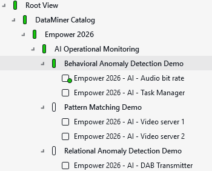
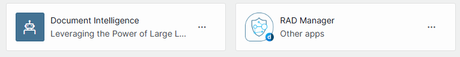

# Empower 2026 - AI Operational Monitoring

## About

This package is the accompanying package for the **Practical AI for operational monitoring** session in the beginners track of Empower 2026.

During this session, we will get hands-on with *Pattern Matching*, *Behavioral Anomaly Detection*, *BAD Feedback*, *Time Scoped Relation Learning*,
*Relational Anomaly Detection* and *Document Intelligence*.

## Elements

The package deploys five elements under the *DataMiner Catalog* > *Empower 2026* > *AI Operational Monitoring* view.

You can use these elements to follow along with the exercises during the session, and to explore the capabilities of various AI features in DataMiner.

The elements will read in history data slowly, and should therefore be deployed during the very first session named **Getting started with DataMiner in seconds**.

## Low-code apps

The package will also deploy a few low-code apps on your system:

- The **Document Intelligence** app, which will be needed to follow along with the exercises on document intelligence.
- The **RAD Manager** app, which will be needed to follow along with the exercises on relational anomaly detection.

